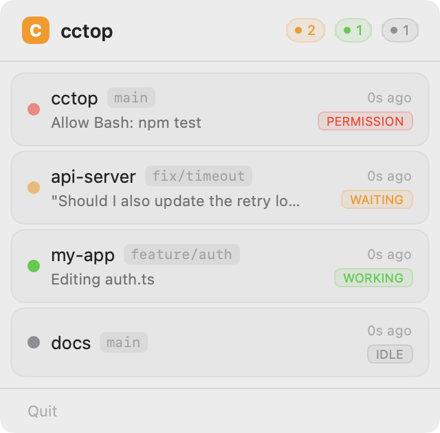

# cctop

[](https://github.com/st0012/cctop/actions/workflows/ci.yml)
[](https://github.com/st0012/cctop/releases/latest)
[](LICENSE)

**Know which Claude Code sessions need you — without switching tabs.**

If you run multiple Claude Code sessions across different projects, you know the pain: constantly cycling through terminal tabs to check which ones are waiting for input, which need permission, and which are still working. cctop sits in your macOS menubar and shows you the status of every session at a glance — so you only switch when something actually needs you.

<p align="center">
  
</p>

## Features

- Lives in your menubar — always one click away
- Real-time session status: idle, working, waiting for input, waiting for permission
- Shows current tool or prompt context for each session
- Click to jump directly to the session's terminal
- Includes a TUI (`cctop`) for terminal-based monitoring

## Installation

### Homebrew

```bash
brew tap st0012/cctop
brew install --cask cctop
```

### Download manually

1. Download `cctop-macOS-arm64.zip` (Apple Silicon) or `cctop-macOS-x86_64.zip` (Intel) from the [latest release](https://github.com/st0012/cctop/releases/latest)
2. Unzip and move `cctop.app` to `/Applications/`
3. Right-click the app and select "Open" (required on first launch since the app is not notarized)

Or from the command line:

```bash
curl -sL https://github.com/st0012/cctop/releases/latest/download/cctop-macOS-arm64.zip -o cctop.zip
unzip cctop.zip
mv cctop.app /Applications/
open /Applications/cctop.app
```

### Install the Claude Code plugin

The plugin registers hooks so Claude Code reports session activity to cctop.

```bash
claude plugin marketplace add st0012/cctop
claude plugin install cctop
```

Restart any running Claude Code sessions to activate hooks (type `/exit` then reopen).

### Build from source

Requires [Rust](https://rustup.rs/) and Xcode (for the menubar app).

```bash
# Install the Rust binaries (TUI + hook)
cargo install --path .

# Build the menubar app
xcodebuild build -project menubar/CctopMenubar.xcodeproj -scheme CctopMenubar -configuration Release -derivedDataPath menubar/build/ CODE_SIGN_IDENTITY="-"
cp -R menubar/build/Build/Products/Release/CctopMenubar.app /Applications/
```

Run `cctop` for the TUI, or open `CctopMenubar.app` for the menubar app.

## How It Works

```
Claude Code  ──hook events──>  cctop-hook  ──JSON──>  ~/.cctop/sessions/
                                                             │
                                              ┌──────────────┤
                                              ▼              ▼
                                        Menubar app      TUI (cctop)
```

1. The cctop plugin registers hooks with Claude Code
2. Hooks fire on session events (start, prompt, tool use, stop, notifications)
3. `cctop-hook` writes session state as JSON to `~/.cctop/sessions/`
4. The menubar app and TUI watch these files and display live status

## Configuration

Create `~/.cctop/config.toml` to customize the editor used for "jump to session":

```toml
[editor]
process_name = "Code"      # or "Cursor", "Code - Insiders"
cli_command = "code"        # or "cursor", "code-insiders"
```

## TUI

The `cctop` command launches a terminal-based UI as an alternative to the menubar app.


```bash
cctop              # Launch TUI
cctop --list       # List sessions as text (no TUI)
```

| Key | Action |
|-----|--------|
| Up/Down or k/j | Navigate sessions |
| Enter | Jump to selected session |
| Right/Left | Detail view / back |
| r | Refresh |
| R | Reset selected session to idle |
| q, Esc, Ctrl+C | Quit |

## Uninstall

```bash
# Remove the menubar app
rm -rf /Applications/cctop.app

# Remove the Claude Code plugin
claude plugin remove cctop
claude plugin marketplace remove cctop

# Remove session data and config
rm -rf ~/.cctop
```

If installed via Homebrew: `brew uninstall --cask cctop`

## Privacy

All data stays local. cctop stores session metadata (status, project name, timestamps) in `~/.cctop/sessions/`. Nothing is sent to any server.

## FAQ

**Does cctop slow down Claude Code?**
No. The hook runs as a separate process that writes a small JSON file and exits immediately. There is no measurable impact on Claude Code performance.

**Does it work with Cursor / VS Code / other editors?**
Yes. cctop monitors Claude Code sessions regardless of which editor you use. The "jump to session" feature supports VS Code and Cursor out of the box — configure others in `~/.cctop/config.toml`.

**Does it work on Linux?**
The TUI (`cctop`) works on Linux. The menubar app is macOS-only.

## License

MIT
