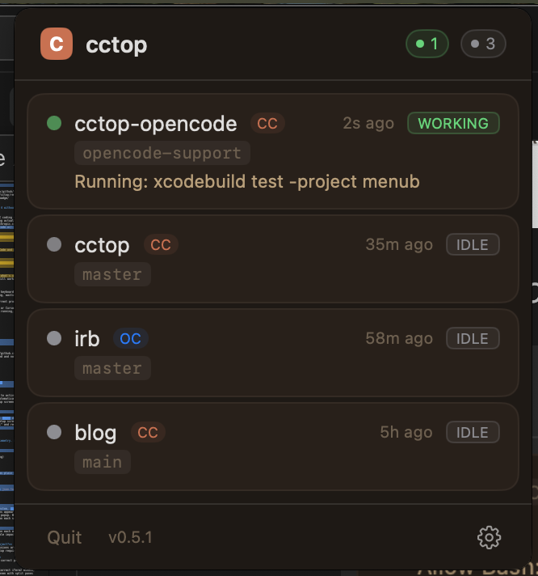

# cctop

[](https://github.com/st0012/cctop/releases/latest)
[](LICENSE)

**Know which AI coding sessions need you — without switching tabs.**

A macOS menubar app that monitors your AI coding sessions at a glance — so you only switch when something actually needs you. Works with [Claude Code](https://docs.anthropic.com/en/docs/claude-code) and [opencode](https://github.com/nicholasgriffintn/opencode).

<p align="center">
  
</p>

<p align="center"><em>Monitoring sessions across projects.</em></p>

<p align="center">
  
</p>

<p align="center"><em>Status badges show what's urgent — permission requests, waiting input, or still working.</em></p>

## Features

- Lives in your menubar — one click or a keyboard shortcut away
- Color-coded status badges: idle, working, waiting for input, waiting for permission, compacting
- See what each session is doing: the current prompt, tool being used, or last activity
- Click a session to jump to its VS Code or Cursor window
- Native macOS app — lightweight, always running, no Electron

## Installation

### Step 1: Install the app

**Homebrew:**

```bash
brew tap st0012/cctop
brew install --cask cctop
```

Or [download the latest release](https://github.com/st0012/cctop/releases/latest) — the app is signed and notarized by Apple.

### Step 2: Install the plugin for your tool

The app needs a plugin to receive session events. Install the one that matches your tool (or both — sessions from all tools appear in the same menubar popup).

<details open>
<summary><strong>Claude Code</strong></summary>

```bash
claude plugin marketplace add st0012/cctop
claude plugin install cctop
```

Restart any running Claude Code sessions to activate (`/exit` then reopen). New sessions are tracked automatically — no per-project config needed.

</details>

<details>
<summary><strong>opencode</strong></summary>

```bash
mkdir -p ~/.config/opencode/plugins/cctop
cp plugins/opencode/plugin.js ~/.config/opencode/plugins/cctop/
```

Restart opencode to activate. Sessions are tracked automatically — no per-project config needed.

</details>

## Privacy

**No network access. No analytics. No telemetry. All data stays on your machine.**

cctop stores only:

- Session status (idle / working / waiting)
- Project directory name
- Last activity timestamp
- Current tool or prompt context

This data lives in `~/.cctop/sessions/` as plain JSON files. You can inspect it anytime:

```bash
ls ~/.cctop/sessions/
cat ~/.cctop/sessions/*.json | python3 -m json.tool
```

## FAQ

**Does it work with opencode?**
Yes. Install the opencode plugin (see Step 2 above) and sessions appear automatically alongside Claude Code sessions in the same menubar popup. When running both tools, a small CC/OC badge appears on each session card to tell them apart.

**Does cctop slow down my coding tool?**
No. The plugin writes a small JSON file on each event and returns immediately. There is no measurable impact on performance.

**Do I need to configure anything per project?**
No. Once the plugin is installed, all sessions are automatically tracked. No per-project setup required.

**Does it work with VS Code and Cursor?**
Yes. Clicking a session card focuses the correct project window.

**Does it work with iTerm2?**
Yes. Clicking a session card raises the correct iTerm2 window, selects the tab, and focuses the pane — even with split panes or multiple windows.

> [!NOTE]
> Requires macOS Automation permission. You'll be prompted to grant it on first use.

**Does it work with Warp or other terminals?**
It activates the app but cannot target a specific terminal tab. You'll need to find the right tab manually.

**How does cctop name sessions?**
By default, the project directory name (e.g. `/path/to/my-app` shows as "my-app"). In Claude Code, you can rename a session with `/rename` and cctop picks that up.

**Why does the app need to be in /Applications/?**
The Claude Code plugin looks for `cctop-hook` inside `/Applications/cctop.app`. Installing elsewhere breaks the hook path. (The opencode plugin writes session files directly and does not need the app in a specific location.)

## Uninstall

```bash
# Remove the menubar app
rm -rf /Applications/cctop.app

# Remove the Claude Code plugin
claude plugin remove cctop
claude plugin marketplace remove cctop

# Remove the opencode plugin
rm -rf ~/.config/opencode/plugins/cctop

# Remove session data and config
rm -rf ~/.cctop
```

If installed via Homebrew: `brew uninstall --cask cctop`

<details>
<summary>How it works</summary>

Both tools write to the same session store — the menubar app doesn't care where the data comes from.

```
┌─────────────┐    hook fires     ┌────────────┐
│ Claude Code │ ────────────────> │ cctop-hook │ ──┐
│  (session)  │  SessionStart,    │  (Swift)   │   │  writes JSON
│             │  Stop, PreTool,   │            │   │  per-session
└─────────────┘  Notification,…   └────────────┘   │
                                                   ▼
                                           ┌───────────────────┐
                                           │ ~/.cctop/sessions │
                                           │   ├── 123.json    │
                                           │   ├── 456.json    │
                                           │   └── 789.json    │
                                           └──────────┬────────┘
┌─────────────┐   plugin event    ┌────────────┐      │
│  opencode   │ ────────────────> │ JS plugin  │ ──┘  │ file watcher
│  (session)  │  session.status,  │            │      ▼
│             │  tool.execute,…   │            │  ┌──────────────┐
└─────────────┘                   └────────────┘  │ Menubar app  │
                                                  │ (live status)│
                                                  └──────────────┘
```

1. Each tool has its own plugin that translates events into session state
2. **Claude Code**: hooks invoke `cctop-hook` (a Swift CLI), which writes JSON session files
3. **opencode**: a JS plugin listens to events and writes the same JSON format directly
4. Both write to `~/.cctop/sessions/` — the menubar app watches this directory and displays live status

</details>

<details>
<summary>Build from source</summary>

Requires Xcode 16+ and macOS 13+.

```bash
git clone https://github.com/st0012/cctop.git
cd cctop
./scripts/bundle-macos.sh
cp -R dist/cctop.app /Applications/
open /Applications/cctop.app
```

</details>

## License

MIT
