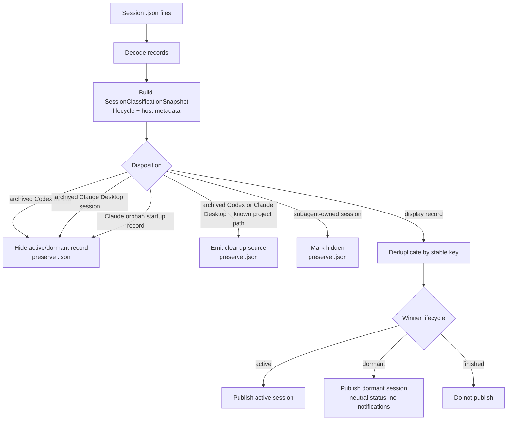
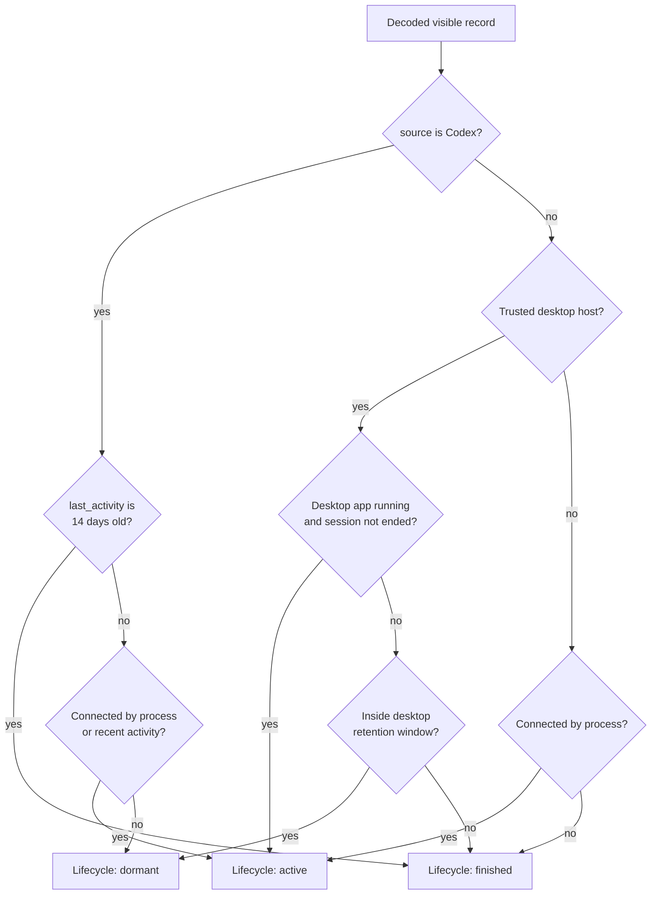
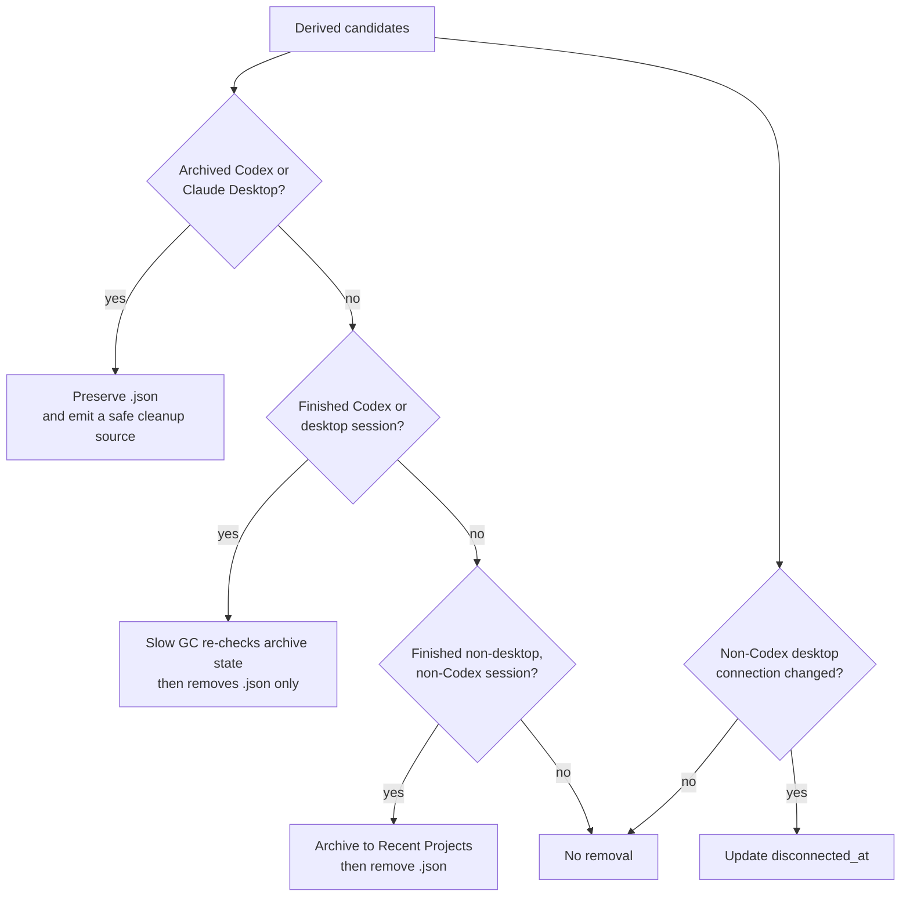

# Session Lifecycle

This flow documents how cctop turns a session file into one internal classification. The display-time lifecycle is
`active`, `dormant`, or `finished`. Claude Desktop has a desktop lifecycle. All Codex surfaces share one Codex lifecycle.

The key split is intentional:

- File presence means cctop has a record to evaluate. It is not itself proof that the session is live.
- Classification decides whether a decoded record can be displayed, hidden, archived to Recent, or used as a cleanup source.
- Connection evidence decides whether the host is connected right now.
- Lifecycle decides how cctop should treat a visible record.
- Persistence actions update `disconnected_at`, remove stale files, or archive finished non-Codex CLI work.
- `disconnected_at` is the retention clock for non-Codex desktop sessions, currently Claude Desktop.
- Every Codex session uses `last_activity` for the same 14-day limit, regardless of its host.
- Before that limit, a disconnected Codex session is dormant. At the limit, the session is finished.
- Other CLI and ambiguous sessions become finished when they disconnect.

## Display Pipeline

## Lifecycle Derivation

## Persistence Actions

## Field Meanings

### `ended_at`

`ended_at` is set when a hook observes `SessionEnd`. It is an explicit disconnect signal for every host class.

For trusted desktop records, `ended_at` still wins over app-level liveness. A running desktop app keeps non-ended visible records active, but it does not make an older ended hook record active again.

New activity clears `ended_at` so a resumed session can become connected again.

### `disconnected_at`

`disconnected_at` controls retention only for non-Codex desktop sessions, currently Claude Desktop. It starts that desktop retention window.

It can be set in two ways:

- A Claude Desktop `SessionEnd` stamps it at the same time as `ended_at`.
- The menubar app can stamp it when it first observes a desktop-hosted session as dormant.

The menubar app clears it when the session becomes active again.

Codex lifecycle does not read `disconnected_at`, even when a Codex record contains this field. Codex uses `last_activity` and the 14-day limit.

## Dedup and Cleanup

Session files are deduplicated by a stable identity key before publishing. `SessionIdentityPolicy` owns that grouping rule. Codex sessions use `session_id` across both old PID-keyed files and newer `codex-<session_id>` files. Known desktop sessions also use `session_id`; other terminal or ambiguous sessions keep PID identity.

Archived active or dormant Codex threads are filtered before display dedup regardless of whether their cctop record came from Codex Desktop, Codex CLI, VS Code, or another Codex surface. This archive rule does not classify the record as Desktop. cctop does not persist `hidden = true` or remove the `.json`, so an unarchived thread that is otherwise active becomes visible again. A transiently unreadable Codex state store retains the last authoritative classification; when no readable archive evidence has ever been available, display fails open rather than guessing.

Archived Codex records do not enter Recent. A record with a safe project path can emit a worktree cleanup source without deleting its session JSON. This rule applies to every Codex surface. Bundle identity is not required. If archive state is unreadable, cctop preserves the record and does not guess.

Archived Claude Desktop records use the same preserve-and-cleanup behavior. They require trusted Claude Desktop metadata. Missing or unsafe path evidence emits no cleanup source.

Deleted or missing desktop conversations are narrower than archived conversations. Missing Codex thread rows, orphaned ended Claude Desktop records, and Claude startup placeholders stay hidden and preserve their session JSON, but they do not become cleanup sources unless the host metadata explicitly marks the conversation archived. That keeps cleanup eligibility tied to an affirmative archive signal rather than treating every metadata miss as abandonment.

Worktree cleanup consumes `SessionClassificationSnapshot.cleanupSources` plus already-ended history records. The scanner validates filesystem and Git state from those sources. It does not classify sessions again. Active display paths and locally hidden or helper paths stay protected. Archived Codex and Claude Desktop records can become cleanup sources while their session JSON stays present.

Internal helper sessions are filtered before dedup and cleanup, then persisted as `hidden = true`. Any client can mark a session file with `is_subagent = true`. For Codex, structured `threads.source` is authoritative: `SubAgent(...)` and `Internal(...)` are helper sources, while `cli` and `vscode` are interactive roots even when `thread_source = 'subagent'`. Spawn edges are secondary corroboration; unknown, malformed, or contradictory evidence remains visible and is diagnosed conservatively. Sticky Codex `is_subagent`/`hidden` state is repaired only for a proven interactive root with a readable edge table, no spawn edge, and no independent auto-hide cause. The parent session's `active_subagents` list remains visible, because it describes delegated work owned by the user-facing session rather than making the parent itself a helper.

Finished non-Codex terminal or ambiguous sessions are archived to Recent Projects and then removed. Codex does not enter this legacy Recent path. The slow GC removes an unarchived Codex record only after the 14-day limit and a fresh archive check.

When `SessionStart` lands on an undecodable PID-keyed session file, the hook may replace that file with a fresh record and continue project cleanup for the new process. Later non-start events still preserve undecodable files, and decoded Codex or trusted-desktop mismatches are refused even at `SessionStart`. Those refused files recover through the normal app path: the menubar app classifies the stale desktop record, lifecycle/GC rechecks external archive state under lock before deletion, and a later hook can recreate the live session once the blocking stale file is gone. This intentionally favors avoiding clobber of trusted desktop/Codex records over adopting an ambiguous colliding PID immediately.

`SessionLifecyclePolicy` owns the derived state question: whether the record is connected, and whether a disconnected record should be active, dormant, or finished for its host class. The lifecycle remains display-time state only; it is not persisted to the session file.

## Host and Source Coverage

Claude Desktop enters the desktop lifecycle through its trusted bundle ID:

- Claude Desktop: `com.anthropic.claudefordesktop`

When Claude Desktop stops, cctop keeps its visible sessions dormant during the retention window. The slow GC removes finished records after a lock-held metadata check.

Every `source: "codex"` record uses the same Codex lifecycle. The host can be Codex Desktop, CLI, VS Code, or another editor. Process or recent hook activity makes the session active. A disconnected session stays dormant until `last_activity` reaches 14 days. Bundle and app-server evidence do not change this lifecycle.

The archive metadata source is client-specific:

- Claude Desktop archive state is read from Claude Desktop's `claude-code-sessions` metadata files, keyed by `cliSessionId`.
- Codex archive visibility starts from Codex's local thread state, keyed by thread id, and applies to every Codex surface. When that row includes a rollout path, cctop checks the active and archived rollout-file locations; if exactly one exists, file placement is treated as the stronger archive signal. If placement is ambiguous or unavailable, cctop falls back to the thread-state archive flag.

Codex thread state may live in more than one `state_5.sqlite` location. cctop first asks the running Codex Desktop app-server for its SQLite home, then falls back to Codex config and static `CODEX_HOME` paths. cctop does not trust its own `CODEX_SQLITE_HOME` environment variable for this decision, because normal Finder, Dock, and Sparkle launches do not inherit the shell environment that started cctop during development.

Claude Desktop visibility also filters unended startup-only records when readable Claude metadata has no matching `cliSessionId` and the session is still idle with no name, prompt, tool, notification, or subagent evidence. For ended or disconnected records, cctop validates against the same metadata; if the store is readable but has no matching metadata, cctop treats the record as an orphan startup hook record and hides it without mutating or deleting the `.json`. If the metadata store is missing, the metadata-backed orphan check fails open and the record follows the normal lifecycle. If matching metadata cannot be read, display fails open for that pass while GC keeps the `.json` rather than deleting uncertain state.

`com.openai.codex` identifies the Codex app for launch. A persisted `com.openai.codex` value does not select focus. Direct terminal/editor metadata wins. Without it, cctop opens the exact task in the installed Codex app. If that fails, cctop reports an error instead of opening Finder. Focus inputs do not control lifecycle, archives, Cleanup, Recent, badges, or notifications.

## Why This Shape

Codex provides one conversation across several possible hosts. A host label is not a stable lifecycle boundary. The source-level policy avoids different behavior when the same conversation moves between Desktop, CLI, and an editor.

The 14-day limit removes old unarchived Codex records. An archive signal preserves the record and makes a safe worktree available to Cleanup.
