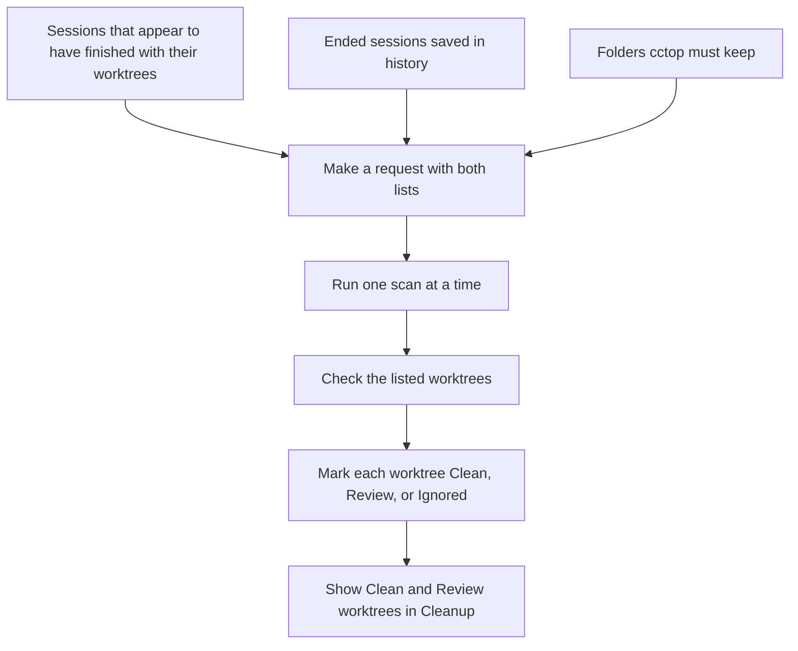
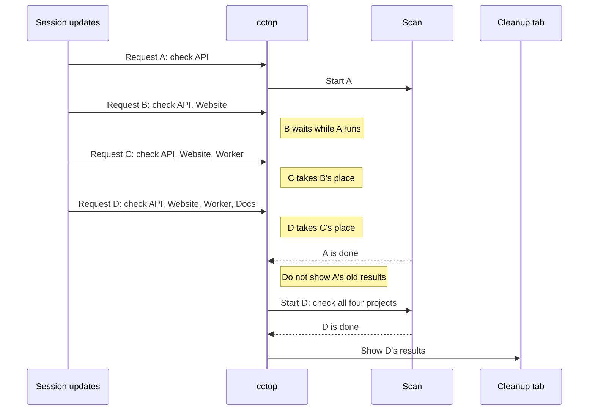
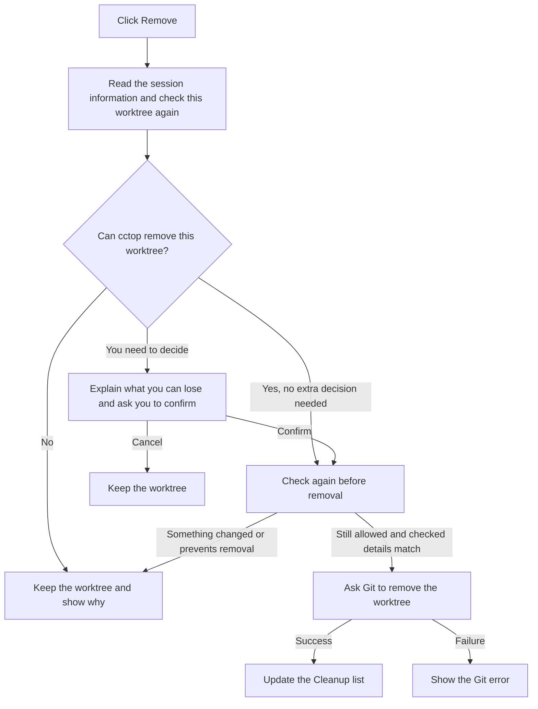

# Worktree Cleanup

Cleanup shows Git worktrees that can remain after sessions end or enter the archive.
A worktree is a separate working folder for a Git repository. One project can
have several worktrees.

A **scan** checks those folders and builds the list you see in Cleanup.
When you click **Remove**, cctop checks that worktree again before it asks Git to
remove the folder. A scan alone does not remove anything.

## How cctop builds the list to check

cctop uses the project folders recorded in its sessions and saved history.
It does not search your whole computer for repositories.

It builds two lists:

- **Worktrees to check:** folders from sessions that appear to have finished with their worktrees.
- **Folders to keep:** folders that sessions can still need. This includes some hidden or temporarily disconnected sessions.

For example, two sessions can use the same worktree. If one ends and the other
still needs the folder, cctop keeps that worktree out of Cleanup.
The [session lifecycle guide](session-lifecycle.md#dedup-and-cleanup) explains which sessions contribute to each list.

The scan starts with the folder recorded for a session. That folder can be
inside a worktree, or the worktree can already be gone.
The code calls this session information a **cleanup source** (`SessionDataCleanupSource`).

The code calls the result for one worktree a **candidate**
(`WorktreeCleanupCandidate`). If several sessions used the same worktree,
the scan produces one result for that worktree.

## What a request asks cctop to check

A **refresh request** means: "Check every worktree on this list, then update Cleanup."
One request can cover many projects. It carries the whole list to check,
including projects that have not changed since the previous request.

The code calls it `RefreshRequest`. It contains:

| Code field | What it carries |
| --- | --- |
| `cleanupSources` | The full list of sessions whose folders need checking. Each entry includes the folder, session ID, name, branch, and time. |
| `activeProjectPaths` | The full list of folders to keep because sessions can still need them. |
| `onCompletion` | An action to run after cctop updates the results. For example, mark Cleanup to tell you that it found another worktree. |

Each request keeps its own copy of these lists. It does not contain a copy
of the files. When the scan runs, it reads the files and asks Git about their
current state.

## When cctop asks for another scan

There are two common reasons for another scan:

- **The session information changes.** For example, a session ends and its folder
  joins the list to check. cctop asks for a scan of the whole list, even with
  Cleanup closed. If the scan finds another worktree to show you, cctop marks
  Cleanup to show that something is new.
- **You open Cleanup.** cctop asks for a scan each time you open it. For example,
  you can edit a file after the previous scan. The next scan checks the file
  again, even though the list of worktrees is the same.

Not every session update needs another scan. cctop compares the next request
with the previous request. It compares the session IDs, folder paths, names,
branches, times, and folders to keep. If those details match, it skips the request.
This comparison does not read the files inside the worktrees.

When you open Cleanup, cctop scans even if those details match.
The code calls this a **forced refresh**. Here, "forced" means that cctop must
check again. It does not mean that cctop removes anything.

## Why a newer request replaces an older one

Only one scan of the list runs at a time. While that scan runs, cctop keeps one
request waiting. If another request arrives, it replaces the waiting request.
The running scan continues until it finishes.

In the example below, A, B, C, and D are requests. API, Website, Worker, and Docs
are projects. Each request lists every project to check at that moment.

B asks cctop to check API and Website. C adds Worker. D includes all three and
adds Docs. The scan for D checks Website and Worker too.
Skipping B and C does not skip those projects because D still lists them.

The list can also shrink. If a worktree is no longer listed, the next request
will not ask cctop to check it. If the newest request has an empty list,
its scan leaves Cleanup empty.

When A finishes, cctop already has the newer list from D. It discards A's results
and starts D. If another request arrives during D, the same rule applies again.
cctop updates Cleanup only after a scan finishes with no newer request waiting.
It then runs that request's `onCompletion` action.

cctop finishes one scan before it starts the newest waiting request.
This keeps repeated requests from starting many scans and Git commands at once.

One scan can still take a long time or use a lot of memory.
The newest request also depends on the session information that cctop supplies.
If cctop incorrectly treats a session as finished, the newest list can still be wrong.
The one-scan limit controls how many scans run at once. It does not correct that session mistake.

This limit applies to scans of the whole list. When you click Remove,
cctop runs separate checks for the selected worktree.

## How cctop checks a worktree

For each folder on the list, cctop does these checks.
The code that does this work is `WorktreeCleanupScanner`.

1. **Find the worktree.** A session can use a subfolder. cctop finds
   the worktree that contains it. If several sessions point to it, cctop uses
   the most recent session's name and time for the result.
2. **Leave out folders that do not belong in Cleanup.** cctop leaves out worktrees
   that sessions still need. It also leaves out missing folders and the original
   repository folder, called the **main checkout**. Git must recognize the folder
   as an additional worktree for that repository, called a **linked worktree**.
3. **Look for files that removal can delete.** cctop asks Git about changes to
   files it already tracks, new files it does not track, and files it normally
   ignores. For example, an ignored file can contain build output or local settings.
4. **Look for commits that need attention.** Git can compare a branch with another
   branch, called its **upstream branch**. cctop checks for commits that are absent
   from that branch. A missing comparison branch also needs review.
5. **Look for reasons to stop removal.** For example, the worktree can be locked,
   or Git can fail to report its files. Some worktrees contain other repositories,
   called **submodules**. If Git checked out those submodules inside the worktree,
   cctop blocks removal. If Git settings hide tracked files from normal checks,
   cctop also blocks removal.
6. **Measure the folder size.** If cctop cannot measure it, Cleanup shows the size
   as unknown. An unknown size alone does not prevent removal.

Some folders need permission from macOS before cctop can read them.
cctop skips ordinary project folders in these locations before it reads their files.
It treats folders inside Claude or Codex worktree directories differently.
Those folders can appear in Cleanup with a message that asks you to grant file access.

The code that asks Git about a worktree is `GitWorktreeInspector`.
One worktree can need several Git commands. For each command, cctop waits for
Git to finish and reads its output before it continues.

## What you see after a scan

Each worktree gets one of these results:

| Result | What it means for you |
| --- | --- |
| **Clean** (`clean`) | cctop found no reason to ask you for another decision. It still checks the worktree again after you click Remove. |
| **Review** (`review`) | cctop found something that needs your attention. It explains the reason, then either asks for your confirmation or blocks removal. |
| **Ignored** (`ignored`) | The worktree stays out of the Cleanup list, for example because another session still needs it. |

Cleanup shows the Clean and Review worktrees. While a new scan runs, the old
list stays visible with a scanning message. If there are no old results, cctop
shows a scanning message until the scan finishes.
The code uses `isScanning` to show this message. It stays true through the current
scan and any newer scan that waits behind it.

The mark for new results compares the scan results with the worktrees last shown
to you in Cleanup. If the scan finds another worktree while Cleanup is closed,
the mark appears. When you open Cleanup, cctop records the results as seen and
clears the mark.

## What happens when you click Remove

When you open a row, you see the worktree details. When you click Remove,
cctop reads the session information again and checks that worktree again.
For example, another session can start using the folder after the earlier scan.
cctop must check whether that folder now needs to stay.

For a Clean worktree, cctop continues without another confirmation.
For a Review worktree, the next step depends on what cctop found:

- If removal can discard local work, cctop asks you to accept that risk.
- If a lock or failed file check prevents removal, cctop stops and explains why.

Before it asks Git to remove the worktree, cctop checks it again.
It compares the folder, branch, current commit, recorded file paths, and reasons
for review with the details you accepted. If those details changed, cctop stops
so you can review the new result. These checks do not compare every file's contents.

The code that asks Git to remove the worktree is `WorktreeRemovalService`.
It runs the Git command from the main checkout. If tracked files have changes
or new files are not ignored, removal needs `--force`. cctop uses this option
after you accept the risk.
This tells Git to remove the folder despite those local changes.
Git can delete ignored files even without `--force`.

The removal command removes the worktree. cctop does not also delete its branch
or erase the session history.
After successful removal, cctop updates the visible Cleanup list. The removed
worktree disappears because its folder is gone. If Git fails, cctop shows the error.

## Where to find this in code

- [SessionManager](../menubar/CctopMenubar/Services/SessionManager.swift): builds the lists of folders to check and keep.
- [WorktreeCleanupManager and WorktreeCleanupRefreshGate](../menubar/CctopMenubar/Services/WorktreeCleanupManager.swift): request scans, keep the newest waiting request, and update the visible results.
- [WorktreeCleanupScanner](../menubar/CctopMenubar/Services/WorktreeCleanupScanner.swift): checks each worktree and decides its result.
- [GitWorktreeInspector](../menubar/CctopMenubar/Services/GitWorktreeInspector.swift): runs Git commands and reads their output.
- [WorktreeRemovalService](../menubar/CctopMenubar/Services/WorktreeRemovalService.swift): checks the selected worktree again and asks Git to remove it.
